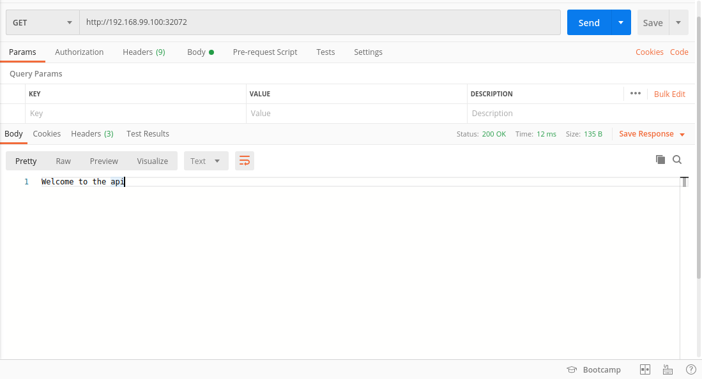

# Deploying an app to k8s cluster with minikube

This tutorial for beginners in kubernetes or who scares to start learn kubernetes.Therefore tutorial only covers kubernetes basics.

Assuming you have knowledge about docker, golang, and what is kubernetes.

## Stages

We assume you already have git, docker and golang on your machine.

### First Thing First

Get repository on your machine and get in repository folder.

```bash
git clone git@github.com:serkanerip/k8s-go-pg-example.git
cd k8s-go-pg-example
```

### Install Kubectl

Kubectl, is a tool to manage kubernetes clusters.[For more.](https://kubernetes.io/docs/reference/kubectl/overview/)

```bash
curl -LO https://storage.googleapis.com/kubernetes-release/release/`curl -s https://storage.googleapis.com/kubernetes-release/release/stable.txt`/bin/linux/amd64/kubectl
chmod +x ./kubectl
sudo mv ./kubectl /usr/local/bin/kubectl
```

### Install Minikube

Minikube is a tool that makes it easy to run Kubernetes locally.[For more.](https://kubernetes.io/docs/setup/learning-environment/minikube/)

```bash
curl -Lo minikube https://storage.googleapis.com/minikube/releases/latest/minikube-linux-amd64 \
  && chmod +x minikube && sudo mv minikube /usr/local/bin
```

### Create Docker Image

```bash
docker build -t [DOCKER_HUB_USERNAME]/k8s-go-pg-example .
```

### Push Image To Docker Hub

#### DockerHub

```bash
docker push [DOCKER_HUB_USERNAME]/k8s-go-pg-example
```
#### Gcloud Registry

```bash
docker image tag [IMAGE_TAG] gcr.io/[PROJECT_ID]/k8s-go-pg-example
docker push gcr.io/[PROJECT_ID]/k8s-go-pg-example
```

### Start Minikube

Make sure you moved minikube binary to /usr/local/bin. Or use in current path with ```./minikube start``` command.

```bash
minikube start
```

### Create Secret File On Cluster

Kubernetes Secrets let you store and manage sensitive information, such as passwords, OAuth tokens, and ssh keys. In our tutorial we use it to pass enviroment variables to containers.

```bash
kubectl apply -f deployments/go-pg-secret.yaml
```

### Create Deployment And Service On Cluster For PG

Deployment is a kubernetes resource that creates and manages pods for us. In this stage we creates deployment resource for postgresql database. Pods are closed box in default until we expose them. Therefore we creates a service with ClusterIP type this means this pod only accessible in cluster.

```bash
kubectl apply -f pg-deployments.yaml
kubectl apply -f pg-service.yaml
```

### Create Deployment And Service On Cluster For API

In this stage we creates deployment resource for our api and a service with NodePort type this means we can access this pod over nodes.

```bash
kubectl apply -f api-deployment.yaml
kubectl apply -f api-service.yaml
```

### Get Service Ip From Minikube

İf there is no trouble our application now runs on kubernetes cluster.This sounds cool.🎉🎉

Lets get a url to try our api.

```bash
minikube service api-service --url
```

## Usage

Open the url that minikube gives you in your favorite browser. And you will see our application runs on k8s cluster.



Api have 1 endpoint with 2 http method.
1. /users [GET] -> Retrieves all users but only 100
2. /users [POST] -> Creates a new user. Create a post request with body to create a user.

**body example**
```json
{
    "nickname": "serkanerip",
    "email": "serkanerip@gmail.com",
    "password": "123456"
}
```

I hope this tutorial helps you to start to learn kubernetes. If you are in trouble with doing this example open an issue i will try to help you.
